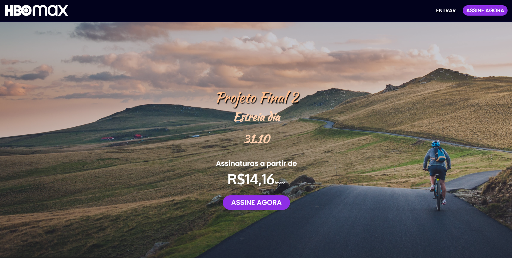

# Projeto Final - Front Estatico 

O repositório Projeto Final - Front Estático tem como finalidade colocar em prática os conhecimentos adquiridos em aula do módulo de Front-End Estático 
O projeto tem como base o site da <a href="https://www.hbomax.com/br/pt">HBO Max</a>, utilizando as linguagens de JavaScript, HTML 5 e CSS 3 para realizar uma reprodução parcial do site de referência 

  

## Como executar
- Clone este repositório em uma pasta local.
- Abra a pasra do projeto com o Visual Studio Code
- Execute o arquivo "index.html" através de seu navegador de preferência

## Link da página estática
- O projeto se encontra no link abaixo 
>https://mateusasf.github.io/ProjetoFinal_FrontEstatico/
